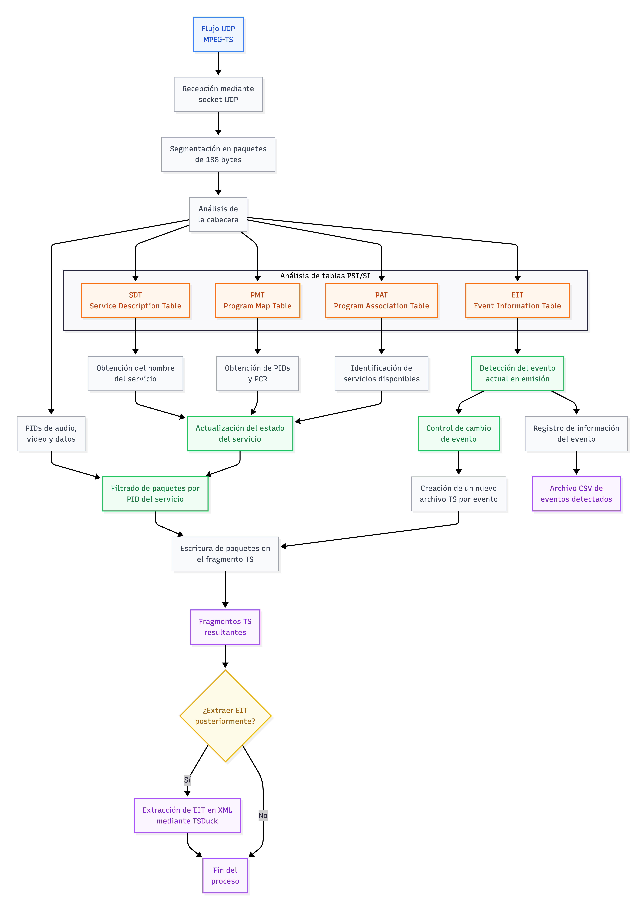

# Segmentador en Tiempo Real de MPEG-TS 

Este proyecto es una herramienta escrita en Python diseñada para ingerir flujos de video UDP  en formato MPEG-TS y segmentarlos automáticamente en archivos `.ts` independientes basándose en la programación en vivo (eventos de la tabla EIT).

## Características Principales

* **Ingesta en Tiempo Real:** Captura tráfico UDP, analizando paquetes de 188 bytes.
* **Análisis DVB PSI/SI:** Reensambla las tablas PAT, PMT, SDT y EIT según los estándares ISO/IEC 13818-1 y ETSI EN 300 468.
* **Segmentación Inteligente:** Detecta el evento actual en emisión (`running_status = 4`) en la EIT Present/Following y corta automáticamente la grabación generando un nuevo fragmento `.ts` nombrado según el evento.
* **Reporte CSV:** Genera un registro detallado con todos los eventos grabados, sus marcas de tiempo, duraciones y etiquetas de clasificación encontradas en la EIT.
* **Integración con TSDuck:** De manera opcional, este sistema permite la extracción posterior de la EIT en formato XML por cada fragmento grabado.

## Diagrama de Flujo

El siguiente diagrama detalla la arquitectura y procesado implementado en el código:



El código de colores utilizado en el diagrama sirve para representar:
* **Azul:** Representa el punto de origen. Representa el _input_ al sistema.
* **Naranja:** Engloban los procesos de extracción y reensamblado de las tablas de metadatos (SDT, PAT, PMT, EIT).
* **Verde:** Aquellos puntos donde se controla la ejecución en función del flujo de contenido. Se toman decisiones sobre la detención de grabación, cambios de eventos, etc.
* **Rombo Amarillo:** Puntos de bifurcación que depende de la decisión del usuario. Para integrarlo en la ejecución, es necesario añadir `--extract-eit-after` en la línea de ejecución.
* **Violeta:** Representa los _outputs_ del sistema. Incluye las propias grabaciones `.ts` y el archivo `.csv` que recoge todo el contenido grabado y sus características más relevantes. Opcionalmente, también genera los archivos `.xml` con la tabla EIT para cada programa.

  
## Uso

El script se ejecuta mediante línea de comandos. Los parámetros principales son la IP/Puerto de origen y el tiempo de grabación en segundos. Opcionalmente, se puede realizar la posterior extracción de la tabla EIT para cada archivo generado mediante el uso de `--extract-eit-after`

``` python grabacion_contenidos.py --record-ip X.X.X.X:YYYY --record-seconds 3600 --output-dir ./Grabaciones --extract-eit-after ```
